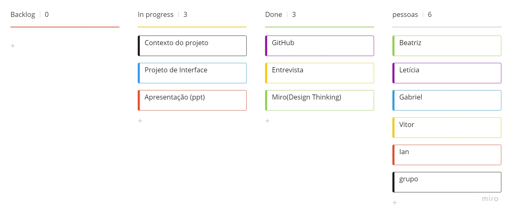

# Informações do Projeto
`TÍTULO DO PROJETO`  

INSÔNIA

`CURSO` 

CIÊNCIA DA COMPUTAÇÃO

## Participantes

> Os membros do grupo são: 
> - Beatriz Fernandes Chiericatti
> - Gabriel Gonçalves Fialho
> - Ian Barbosa de Araujo
> - Letícia Azevedo Cota Barbosa
> - Vitor Augusto Alves da Silva

# Estrutura do Documento

- [Informações do Projeto](#informações-do-projeto)
  - [Participantes](#participantes)
- [Estrutura do Documento](#estrutura-do-documento)
- [Introdução](#introdução)
  - [Problema](#problema)
  - [Objetivos](#objetivos)
  - [Justificativa](#justificativa)
  - [Público-Alvo](#público-alvo)
- [Especificações do Projeto](#especificações-do-projeto)
  - [Personas e Mapas de Empatia](#personas-e-mapas-de-empatia)
  - [Histórias de Usuários](#histórias-de-usuários)
  - [Requisitos](#requisitos)
    - [Requisitos Funcionais](#requisitos-funcionais)
    - [Requisitos não Funcionais](#requisitos-não-funcionais)
  - [Restrições](#restrições)
- [Projeto de Interface](#projeto-de-interface)
  - [User Flow](#user-flow)
  - [Wireframes](#wireframes)
- [Metodologia](#metodologia)
  - [Divisão de Papéis](#divisão-de-papéis)
  - [Ferramentas](#ferramentas)
  - [Controle de Versão](#controle-de-versão)
- [**############## SPRINT 1 ACABA AQUI #############**](#-sprint-1-acaba-aqui-)
- [Projeto da Solução](#projeto-da-solução)
  - [Tecnologias Utilizadas](#tecnologias-utilizadas)
  - [Arquitetura da solução](#arquitetura-da-solução)
- [Avaliação da Aplicação](#avaliação-da-aplicação)
  - [Plano de Testes](#plano-de-testes)
  - [Ferramentas de Testes (Opcional)](#ferramentas-de-testes-opcional)
  - [Registros de Testes](#registros-de-testes)
- [Referências](#referências)

# Introdução

## Problema

A insônia, por definição, é uma condição em que há dificuldade de iniciar o sono, manter-se dormindo, despertar mais cedo do que seria necessário pela manhã, sendo assim está associado ao comprometimento diurno (pessoal, social e ocupacional) e à preocupação com a diminuição do sono  .Portanto é um problema decorrente da irregularidade do tempo adequado do sono e/ou da qualidade do mesmo. Nesse sentido, tal distúrbio pode ser classificada, segundo a Associação Brasileira do Sono,  em Insônia sintomática e Transtorno da Insônia (TI). A primeira refere-se quando a perturbação do sono está associada a outras condições médicas, sociais ou ambientais e a segunda é quando a queixa sobre a insônia constitui a própria doença.

Dessa forma, segundo o Instituto Brasileiro de Opinião Pública e Estatística (IBOPE), no Brasil, 65% da população afirma ter uma baixa qualidade de sono. Sendo assim, mostra-se relevante pensar na qualidade do sono e assim na Insônia, uma vez que as perturbações do sono podem acarretar alterações significativas no funcionamento físico, ocupacional, cognitivo e social do indivíduo, além de comprometer substancialmente a qualidade de vida da pessoa.

## Objetivos

Conforme a Associação Brasileira do Sono, o sintoma de insônia é prevalente em 30% a 35% da população mundial. Nesse sentido, a insônia é um problema que repercute prejuízos familiares, ocupacionais e acadêmicos em uma parte considerável da população. As pessoas que sofrem por tal sintoma /transtorno tem sua saúde física e mental fragilizada, visto que o sono é essencial para manter o organismo funcionando de forma adequada. Tal problema pode ter diferentes causas e consequências para os insones, como por exemplo ansiedade e dependência de remédios para dormir. 

Portanto, a finalidade do projeto é dar apoio as pessoas que têm sintoma ou transtorno de insônia. Sendo assim, criaremos um site web para auxiliar os insones (nome dado para pessoas com insônia) em suas pesquisas e para possibilitar uma visão mais ampla do impacto que o distúrbio tem na vida cotidiana e na saúde física e mental . Portando, o objetivo do trabalho é : disponibilizar, em forma de artigos, informações de instituições confiáveis; ajudar os insones a visualizar hábitos e rotinas que prejudicam sua qualidade de sono; promover um ambiente em que tais pessoas possam comunicar entre si, afim de criar uma rede de apoio . Dessa forma,  poderemos minimizar os sintomas e ajudar pessoas com Insônia.

## Justificativa

O que impulsionou a realização deste trabalho foi ver que a insônia afeta grande porcentagem da população do país, assim ganha particular pertinência abordarmos o tema, para ajudarmos essas pessoas. Este projeto, por sua vez, deve ser utilizado pelos adolescentes e adultos com insônia, fazendo com que entendam, e assim, possam se orientar, cada vez mais sobre esse disturbio, com base na Associação Brasileira do Sono (ABS) voltada às pesquisas sobre a Insônia.

## Público-Alvo

A insônia é um sintoma e também pode ser um transtorno. Visto isso, o público-alvo do nosso trabalho é bastante abrangente, uma vez que pode incluir diferentes faixas etárias, gêneros e classe social. No enteando, de acordo com a 29ª edição da revista "SONO" publicada pela ABS, o perfil de brasileiros que mais sofre com sono ruim são "mulheres jovens, que compartilham a cama com outra pessoa e usam smartphone e mídias interativas na hora de dormir". Logo, tal perfil tornou-se prioridade na construção da nossa aplicação. 

Porém, destaque-se outros perfis que são potencias usuários: 

1.Jovens entre 17-19 anos  que cursaram ou estão cursando o último ano do ensino médio. E, portanto, podem apresentar ansiedade e/ou depressão causados principalmente pela pressão na escolha de uma profissão e a necessidade de ter um rendimento satisfatório no vestibular. Além disso, são pessoas que podem ter um uso exessivo de telas de computadores e smartphones, por isso manifestam o estado de hipervigília*.

2.Mulheres na menopausa, segundo a ABS, podem ter   as percepções do sono alteradas e provavelmente são afetadas por uma instabilidade emocional . A alteração na qualidade do sono relacionam aos sintomas do período de transição da menopausa: ondas de calor (fogachos) e suores noturno. Tais eventos influenciam a fragmentação do sono. Além disso, essas mulheres podem ter outros fatores que diminuem a qualidade do sono. Por exemplo, ansiedades advindas do trabalho e da vida pessoal. 

3.Pessoas com fibromialgia: Dor e sono estão relacionados. De acordo com ABS , alterações no sono são um dos fatores de risco para a fibromialgia. Nesse sentido, o monitoramento do sono é necessário para evitar essa dor. No entanto, pessoas que já possuem a dor crônica continuam relatando queixas relacionadas ao sono, sendo que tal doença atinge principalmente mulheres entre 35 a 50 anos, segundo uma reportagem do uol.

*vigília é o estado de quem está acordado. 

# Especificações do Projeto

A insônia é a principal queixa entre pessoas que sofrem algum distúrbio do sono e está a frente até do ronco. As perspectivas para o futuro não são boas, estima-se que de 30% a 40% da população terá insônia em algum momento da vida.
Este site pretende auxiliar no tratamento de forma natural. 
Aqui os usuários encontrarão artigos, sugestões de terapias cognitivo-comportamentais relacionadas à higiene do sono, e técnicas de relaxamento e de controle dos estímulos.

## Personas e Mapas de Empatia

Thomas Kimon é uma pessoa meticulosa, diplomática, muito preocupado com seu trabalho e em adquirir novos conhecimentos. Tem boas relações e amizades no ambiente de trabalho. Procura sempre reunir os amigos para um bom bate papo, acompanhado de boa comida. Nesta interação com amigos, trabalho e redes sociais, prevê um crescimento profissional e pessoal. Devido ao medo de perder o emprego e de ser criticado, procura sempre estar se atualizando procurando melhorias no seu desempenho profissional.

Maya Gallardo é uma pessoa extrovertida, gosta de estar sempre rodeada de pessoas e está sempre pronta a cooperar com elas. Assim tem boas relações de amizades tanto no universo de trabalho como no pessoal. Gosta de reuni os amigos e familiares sempre que possível, mas  sua frustração é não poder vê-los frequentemente. Prevê grandes oportunidades no mercado de trabalho, devido ao bom relacionamento com profissionais de sua área. Demonstra sempre alegria, adora cantar em público, e vê seu esforço reconhecido nas redes sociais.

Lotus dos Ramos é uma pessoa competitiva e confiante, direta e firme em suas decisões. Gosta de desafios e procura resultados imediatos. Sua preocupação é que devido ao excesso de trabalho não consegue passar mais tempo com sua família, mas procura fazer do pouco tempo, um tempo de qualidade. Gosta de estar entre amigos e com a família reunida. Alguns amigos e familiares às vezes pedem que ela pegue mais leve no trabalho, relaxe um pouco. Vê muita competição no mercado de trabalho de forma machista e racista. Assim, conhecedora do seu potencial, sabe se posicionar para transmitir suas ideias e procura ouvir seus colaboradores. Tem recebido retorno positivo, apoio no seu ambiente de trabalho e de sua família.

## Histórias de Usuários

## Requisitos

As tabelas que se seguem apresentam os requisitos funcionais e não funcionais que detalham o escopo do projeto.

### Requisitos Funcionais

|ID    | Descrição do Requisito  | Prioridade |
|------|-----------------------------------------|----|
|RF-001| Permitir que o usuário cadastre artigos | ALTA | 
|RF-002| Permitir que o usuário faça comentários | Média|
|RF-003| Permitir que o usuário salve os artigos na biblioteca  | ALTA|
|RF-004| Mostrar artigos recomendados  | ALTA|

### Requisitos não Funcionais

|ID     | Descrição do Requisito  |Prioridade |
|-------|-------------------------|----|
|RNF-001| O sistema deve ser responsivo para rodar em um dispositivos móvel | média | 
|RNF-002| Deve processar requisições do usuário em no máximo 3s |  BAIXA | 

# Projeto de Interface

Para tentar solucionar o projeto, nós criamos um site com artigos para ajudar a orientar as pessoas que sofrem com insônia 

> Apresente as principais interfaces da solução. Discuta como 
> foram elaboradas de forma a atender os requisitos funcionais, não
> funcionais e histórias de usuário abordados nas [Especificações do
> Projeto](#especificações-do-projeto).

## User Flow

......  INCLUA AQUI O DIAGRAMA COM O FLUXO DO USUÁRIO NA APLICAÇÃO ......

> Fluxo de usuário (User Flow) é uma técnica que permite ao desenvolvedor
> mapear todo fluxo de telas do site ou app. Essa técnica funciona
> para alinhar os caminhos e as possíveis ações que o usuário pode
> fazer junto com os membros de sua equipe.
>
> **Links Úteis**:
> - [User Flow: O Quê É e Como Fazer?](https://medium.com/7bits/fluxo-de-usu%C3%A1rio-user-flow-o-que-%C3%A9-como-fazer-79d965872534)
> - [User Flow vs Site Maps](http://designr.com.br/sitemap-e-user-flow-quais-as-diferencas-e-quando-usar-cada-um/)
> - [Top 25 User Flow Tools & Templates for Smooth](https://www.mockplus.com/blog/post/user-flow-tools)
>
> **Exemplo**:
> 
> 

## Wireframes
Tela inicial: 

Página de monitoramento: 

Página do forum: 

......  INCLUA AQUI OS WIREFRAMES DAS TELAS DA APLICAÇÃO COM UM BREVE DESCRITIVO ......

> Wireframes são protótipos das telas da aplicação usados em design de interface para sugerir a
> estrutura de um site web e seu relacionamentos entre suas
> páginas. Um wireframe web é uma ilustração semelhante ao
> layout de elementos fundamentais na interface.
> 
> **Links Úteis**:
> - [Ferramentas de Wireframes](https://rockcontent.com/blog/wireframes/)
> - [Figma](https://www.figma.com/)
> - [Adobe XD](https://www.adobe.com/br/products/xd.html#scroll)
> - [MarvelApp](https://marvelapp.com/developers/documentation/tutorials/)
> 
> **Exemplo**:
> 
> 

# Metodologia
Os encontros para a realização do trabalho foram feitos no canal do grupo do discord. Os integrantes do grupo gerenciaram as atividades por meio de um Kanban no miro:

......  COLOQUE AQUI O SEU TEXTO ......

> Nesta parte do documento, você deve apresentar a metodologia 
> adotada pelo grupo, descrevendo o processo de trabalho baseado nas metodologias ágeis, 
> a divisão de papéis e tarefas, as ferramentas empregadas e como foi realizada a
> gestão de configuração do projeto via GitHub.
>
> Coloque detalhes sobre o processo de Design Thinking e a implementação do Framework Scrum seguido
> pelo grupo. O grupo poderá fazer uso de ferramentas on-line para acompanhar
> o andamento do projeto, a execução das tarefas e o status de desenvolvimento
> da solução.
> 
> **Links Úteis**:
> - [Tutorial Trello](https://trello.com/b/8AygzjUA/tutorial-trello)
> - [Gestão ágil de projetos com o Trello](https://www.youtube.com/watch?v=1o9BOMAKBRE)
> - [Gerência de projetos - Trello com Scrum](https://www.youtube.com/watch?v=DHLA8X_ujwo)
> - [Tutorial Slack](https://slack.com/intl/en-br/)

## Divisão de Papéis

A divisão de papeis pode ser vista na imagem acima. As cores designadas para cada pessoa foram colocadas nas atividades para relatar quais pessoas foram encaminhadas. 
Algumas foram decididas durante a realização do projeto e outras foram decididas na primeira reunião do grupo. 

> Apresente a divisão de papéis e tarefas entre os membros do grupo.
>
> **Links Úteis**:
> - [11 Passos Essenciais para Implantar Scrum no seu Projeto](https://mindmaster.com.br/scrum-11-passos/)
> - [Scrum em 9 minutos](https://www.youtube.com/watch?v=XfvQWnRgxG0)

## Ferramentas

......  COLOQUE AQUI O SEU TEXTO - SIGA O EXEMPLO DA TABELA ABAIXO  ......

| Ambiente  | Plataforma              |Link de Acesso |
|-----------|-------------------------|---------------|
|Processo de Design Thinkgin  | Miro |  https://miro.com/welcomeonboard/ZUlEdnlsb3hUcmgyck9Ba1hWQmRDZGpYTkJGRUphV2tLVFRyTm9Rb1NXOFBBemdFM2VBN0d2MnVjN0F6RFRZZHwzNDU4NzY0NTMzODMyNjAzOTYwfDI=?share_link_id=577973328969 | 
|Repositório de código | GitHub | https://github.com/XXXXXXX | 
|Protótipo Interativo | MavelApp ou Figma | https://marvelapp.com/prototype/81f5d83 | 

>
> Liste as ferramentas empregadas no desenvolvimento do
> projeto, justificando a escolha delas, sempre que possível.
> 
> As ferramentas empregadas no projeto são:
> 
> - Editor de código.
> - Ferramentas de comunicação
> - Ferramentas de diagramação
> - Plataforma de hospedagem
> 
> O editor de código foi escolhido porque ele possui uma integração com o
> sistema de versão. As ferramentas de comunicação utilizadas possuem
> integração semelhante e por isso foram selecionadas. Por fim, para criar
> diagramas utilizamos essa ferramenta por melhor captar as
> necessidades da nossa solução.
> 
> **Links Úteis - Hospedagem**:
> - [Getting Started with Heroku](https://devcenter.heroku.com/start)
> - [Crie seu Site com o HostGator](https://www.hostgator.com.br/como-publicar-seu-site)
> - [GoDady](https://br.godaddy.com/how-to)
> - [GitHub Pages](https://pages.github.com/)

## Controle de Versão

......  COLOQUE AQUI O SEU TEXTO ......

> Discuta como a configuração do projeto foi feita na ferramenta de
> versionamento escolhida. Exponha como a gerência de tags, merges,
> commits e branchs é realizada. Discuta como a gerência de issues foi
> realizada.
> A ferramenta de controle de versão adotada no projeto foi o
> [Git](https://git-scm.com/), sendo que o [Github](https://github.com)
> foi utilizado para hospedagem do repositório `upstream`.
> 
> O projeto segue a seguinte convenção para o nome de branchs:
> 
> - `master`: versão estável já testada do software
> - `unstable`: versão já testada do software, porém instável
> - `testing`: versão em testes do software
> - `dev`: versão de desenvolvimento do software
> 
> Quanto à gerência de issues, o projeto adota a seguinte convenção para
> etiquetas:
> 
> - `bugfix`: uma funcionalidade encontra-se com problemas
> - `enhancement`: uma funcionalidade precisa ser melhorada
> - `feature`: uma nova funcionalidade precisa ser introduzida
>
> **Links Úteis**:
> - [Tutorial GitHub](https://guides.github.com/activities/hello-world/)
> - [Git e Github](https://www.youtube.com/playlist?list=PLHz_AreHm4dm7ZULPAmadvNhH6vk9oNZA)
> - [5 Git Workflows & Branching Strategy to deliver better code](https://zepel.io/blog/5-git-workflows-to-improve-development/)
>
> **Exemplo - GitHub Feature Branch Workflow**:
>
> 

# **############## SPRINT 1 ACABA AQUI #############**

# Projeto da Solução

......  COLOQUE AQUI O SEU TEXTO ......

## Tecnologias Utilizadas

......  COLOQUE AQUI O SEU TEXTO ......

> Descreva aqui qual(is) tecnologias você vai usar para resolver o seu
> problema, ou seja, implementar a sua solução. Liste todas as
> tecnologias envolvidas, linguagens a serem utilizadas, serviços web,
> frameworks, bibliotecas, IDEs de desenvolvimento, e ferramentas.
> Apresente também uma figura explicando como as tecnologias estão
> relacionadas ou como uma interação do usuário com o sistema vai ser
> conduzida, por onde ela passa até retornar uma resposta ao usuário.
> 
> Inclua os diagramas de User Flow, esboços criados pelo grupo
> (stoyboards), além dos protótipos de telas (wireframes). Descreva cada
> item textualmente comentando e complementando o que está apresentado
> nas imagens.

## Arquitetura da solução

......  COLOQUE AQUI O SEU TEXTO E O DIAGRAMA DE ARQUITETURA .......

> Inclua um diagrama da solução e descreva os módulos e as tecnologias
> que fazem parte da solução. Discorra sobre o diagrama.
> 
> **Exemplo do diagrama de Arquitetura**:
> 
> 

# Avaliação da Aplicação

......  COLOQUE AQUI O SEU TEXTO ......

> Apresente os cenários de testes utilizados na realização dos testes da
> sua aplicação. Escolha cenários de testes que demonstrem os requisitos
> sendo satisfeitos.

## Plano de Testes

......  COLOQUE AQUI O SEU TEXTO ......

> Enumere quais cenários de testes foram selecionados para teste. Neste
> tópico o grupo deve detalhar quais funcionalidades avaliadas, o grupo
> de usuários que foi escolhido para participar do teste e as
> ferramentas utilizadas.
> 
> **Links Úteis**:
> - [IBM - Criação e Geração de Planos de Teste](https://www.ibm.com/developerworks/br/local/rational/criacao_geracao_planos_testes_software/index.html)
> - [Práticas e Técnicas de Testes Ágeis](http://assiste.serpro.gov.br/serproagil/Apresenta/slides.pdf)
> -  [Teste de Software: Conceitos e tipos de testes](https://blog.onedaytesting.com.br/teste-de-software/)

## Ferramentas de Testes (Opcional)

......  COLOQUE AQUI O SEU TEXTO ......

> Comente sobre as ferramentas de testes utilizadas.
> 
> **Links Úteis**:
> - [Ferramentas de Test para Java Script](https://geekflare.com/javascript-unit-testing/)
> - [UX Tools](https://uxdesign.cc/ux-user-research-and-user-testing-tools-2d339d379dc7)

## Registros de Testes

......  COLOQUE AQUI O SEU TEXTO ......

> Discorra sobre os resultados do teste. Ressaltando pontos fortes e
> fracos identificados na solução. Comente como o grupo pretende atacar
> esses pontos nas próximas iterações. Apresente as falhas detectadas e
> as melhorias geradas a partir dos resultados obtidos nos testes.

# Referências

......  COLOQUE AQUI O SEU TEXTO ......

> Inclua todas as referências (livros, artigos, sites, etc) utilizados
> no desenvolvimento do trabalho.
> 
> **Links Úteis**:
> - [Formato ABNT](https://www.normastecnicas.com/abnt/trabalhos-academicos/referencias/)
> - [Referências Bibliográficas da ABNT](https://comunidade.rockcontent.com/referencia-bibliografica-abnt/)
